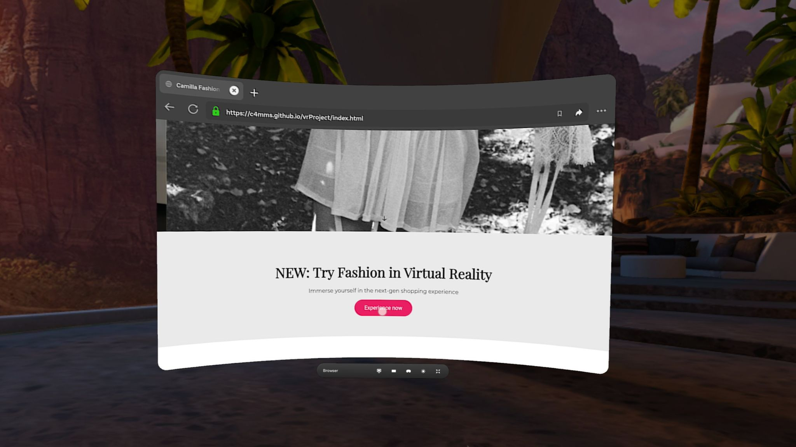

# Virtual Try-On E-Shop (Demo)
## Description
This project is a web-based demo for an innovative e-commerce experience that allows users to **see clothes in Virtual Reality** (VR) before purchasing.
It combines a traditional online shopping layout with VR technology to enhance user engagement and shopping confidence.



## Features
- Standard e-commerce interface (homepage, collections, product pages);

- "Try on VR" button to enter the experience;

- 3D clothing models designed in Blender;

- VR experience powered by A-Frame.

## Usage
### Access the Demo
You can access the demo through this link:  
[https://c4mms.github.io/vrProject/index.html](https://c4mms.github.io/vrProject/index.html)


### Accessing the VR Feature
The VR experience is available in two ways:
  1. **Click the "Experience now" button** to visit the showroom.
  2. **Click the "Try in VR" button** next to the product that ofefr this option.

> **Note:** While the VR feature works on **PC**, **iPad**, and **smartphones**, it is not as optimal as when using a VR headset.


## Technologies Used
- **HTML & CSS**: For building and styling the web interface.
- **JavaScript**: For interactive functionality and logic.
- **A-Frame (WebXR)**: For building immersive VR scenes directly in the browser.
- **Blender**: For designing 3D clothing models used in the VR showroom.
- **Amazon S3**: For hosting 3D .glb models with public access and CORS support.
- **Meta Quest 2**: Recommended hardware for the best VR experience.
- **Browsers**: Compatible with WebXR-enabled browsers such as Meta Browser, Chrome, and Firefox.
  
## Hosting 3D Models with AWS S3
To display .glb files in your VR scenes using A-Frame, you need to host them correctly on AWS S3.

### Step 1: Create an S3 Bucket
1. Go to the [ AWS Management Console](https://eu-north-1.console.aws.amazon.com/s3/home?region=eu-north-1)
2. Click **“Create bucket”**
3. Enter a unique bucket name (e.g., my-glb-files-bucket)
4. Choose an AWS region (you can keep the default or choose your preferred AWS region)
5. Uncheck **“Block all public access”** (Confirm by checking the acknowledgment box for public access)
7. Click **“Create bucket”**


### Step 2: Upload the .glb model
1. Open your newly created bucket
2. Click “Upload” and select your .glb file
3. Set the File’s Metadata :
   - Properties > Scroll to Metadata;
   - Add a Metadata:   Type --> System-Defined      Key --> Content-Type      Value --> model/gltf-binary
4. Upload your .glb file (e.g., jacket.glb).


### Step 3: Set the Bucket policy
To make the files in your S3 bucket publicly accessible:

- In the S3 Bucket, go to **Permissions** > **Bucket Policy**.
- Add the following JSON and click **Save**:
```json
{
  "Version": "2012-10-17",
  "Statement": [
    {
      "Sid": "PublicReadGetObject",
      "Effect": "Allow",
      "Principal": "*",
      "Action": "s3:GetObject",
      "Resource": "arn:aws:s3:::NAMEBUCKET/*"
    }
  ]
}
 ```
> **Note:** replace NAMEBUCKET with your S3 bucket name.

### Step 4: Set the CORS Policy (Cross-Origin Resource Sharing)
To allow your website to access the file from another origin (especially important for A-Frame/WebXR):

- In the S3 Bucket, go to **Permissions** > **CORS Configuration**.
- Add the following JSON and click **Save**:
```json
[
  {
    "AllowedHeaders": ["*"],
    "AllowedMethods": ["GET"],
    "AllowedOrigins": ["*"],
    "ExposeHeaders": [],
  }
]
 ```
  > **Note:** This allows any domain to load your 3D models. For more security, replace "*" in "AllowedOrigins" with your actual domain.

## How to open the file saved in the bucket with A-Frame
This project includes two versions of an **A-Frame-based** ([A-Frame Documentation](https://aframe.io/)): a **static viewer** that always loads the same model (the showroom), and a **dynamic viewer** that loads a model based on a URL parameter (The single products).

### Static Viewer (vr.html)
Always opens the same pre-defined .glb model (in this case showroom.glb).

 **How it works:**
 - The model is referenced inside an **<a-assets> tag** using its direct **URL** from the bucket.
   ```html
   <a-assets timeout="20000">
    <a-asset-item id="showroom-model" src="https://showroomcd.s3.amazonaws.com/showroom.glb"></a-asset-item>
   </a-assets>
   
   <a-entity gltf-model="#showroom-model" position="0 0 0" scale="0.1 0.1 0.1"></a-entity>
   
   ```
    >**Note:** This ensures the model is preloaded before rendering starts, which prevents missing content or visual glitches.
 - Once the page is loaded, the model is automatically displayed in the scene.
 - No input or external interaction is required.

### Dynamic Viewer (vr-clothesViewer.html)
Loads and displays a specific .glb file dynamically by passing its URL as a query parameter.

**How it works:**
- Instead of writing the model **URL** directly into the HTML, it is passed through the page URL and handled via **JavaScript**.
  example:
  ```URL
  https://c4mms.github.io/vrProject/vr/vr-clothesViewer.html model=https%3A%2F%2Fshowroomcd.s3.amazonaws.com%2Fvestitiglb%2Ftshirt.glb
   ```
  
- The **URL** is extracted in **JavaScript** using:
  ```javascript
  const urlParams = new URLSearchParams(window.location.search);
  const modelUrl = urlParams.get('model');
   ```
- If a valid **model URL** is provided, it is decoded and injected into the scene
  ```javascript
  const modelEntity = document.getElementById('model');
  modelEntity.setAttribute('gltf-model', decodedUrl);
  ```
- Event listeners handle model success and error states:
  ```javascript
    modelEntity.addEventListener('model-error', (e) => {
    console.error("Model failed to load:", e.detail.src);
    alert("Failed to load the model...");
    });
  
    modelEntity.addEventListener('model-loaded', () => {
    document.getElementById('loadingOverlay').style.opacity = '0';
    ...
    });
   ```
- This enables **flexibility**: one viewer, many models — just change the URL.
- Includes a loading overlay, controller-based locomotion (rotate + move), and desktop WASD/mouse navigation.

## Future Improvements (Ideas)

- Full-body avatar customization (e.g., height, body shape).
- Add physics (cloth simulation, realistic collisions).
- Enable collision detection in the VR showroom.
- Implement user data storage using a database (e.g., to save favorites, avatar profiles)
- Integrate session and persistent cookies to recognize returning users, personalize content, and support statistical or marketing functionalities.

## Motivation

This project was created as an experimental blend of fashion, design, and immersive technology. Our goal was to rethink the online shopping experience by giving users a sense of presence and realism through VR — transforming browsing into something more interactive and engaging.

## Credits

This project was developed by a two-person team:

3D Models: Created in Blender by **Daniele Turkaj**

Web Development & VR Integration: Handled by **Camilla Molinengo**

## License

This project is licensed under **All Rights Reserved**.  
You may not copy, modify, distribute, or use any part of this project without explicit permission.
